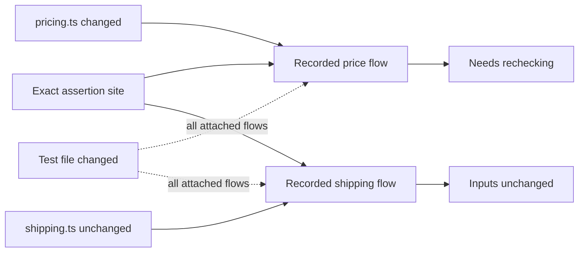
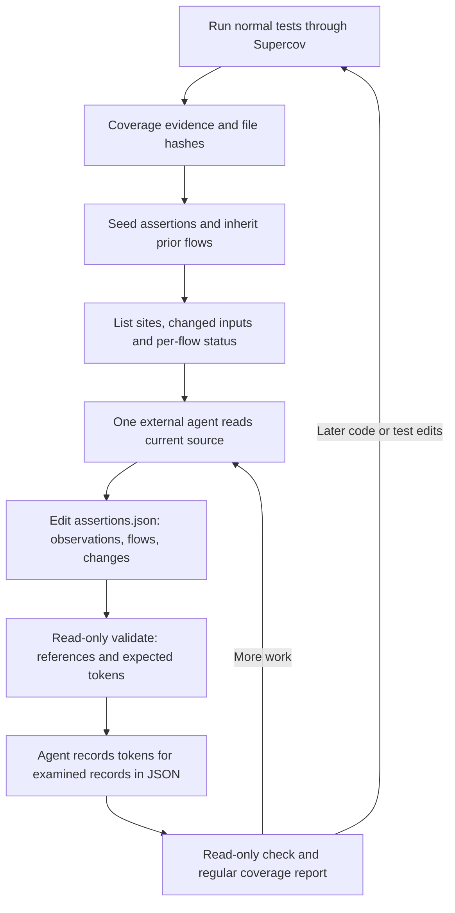

# Assertion maps: format, freshness, and coverage

Supercov should keep one agent-edited `assertions.json` in each test run, identify
each assertion explicitly, and track freshness separately for each recorded
flow. Remove the separate `review` command and the assertion-level
`unmapped` / `partial` / `mapped` completion enum. The report should describe
recorded claims, their input versions, their execution evidence, and outstanding
questions. It should never imply that the expected number of flows is known.

This decision record is based on research checked through September 12, 2026
and an implementation audit at `afd877d`. The schema-2 implementation now follows
this contract; [the published map reference](../assertion-maps.md) documents the
supported CLI. The baseline at `afd877d` used schema 1.
The accompanying [schema](assertion-maps-v2.schema.json) and
[examples](assertion-maps-v2.examples.json) are design artifacts, outside the
published schemas and embedded CLI documentation.

The scope is JavaScript and TypeScript. One external coding agent conducts an
ongoing investigation using its normal source-reading tools and Supercov's Rust
CLI. Supercov stores and assesses the agent's claims; it does not host a model,
reconstruct dependencies with static analysis, or require a task per assertion.

## Evidence behind the decisions

The research supports this architecture as an engineering proposal. It does
not supply a measured accuracy for an arbitrary coding agent performing this
exact task on a JS/TS repository. Static slicing, recovery of one dynamic
dependency, test generation, and complete suite-level assertion maps are
different evaluation targets.

| Work | What was evaluated or implemented | Consequence for this design |
| --- | --- | --- |
| **SliceMate, 2025 preprint** | GPT-4o agents generate and revise static slices without first constructing a full dependency graph. SliceBench contains 2,200 Java/Python cases. On its larger GitHub cases, Python precision/recall/F1 are 93.1/68.9/76.1%, with 2% exact match; Java has 89.6/67.5/73.6%, with 6% exact match. | The closest general agent workflow. Its completeness check is another model assessment. Strong statement accuracy does not establish a complete slice. Its three-agent arrangement is not required by Supercov's file contract. [Paper, Table 1](https://arxiv.org/html/2507.18957v1#S5.T1) |
| **RecovSlicing, September 2025 revision** | Recovers one-step dynamic data dependencies from partial traces and source, with GPT-4o and a quantized Gemma 3 27B variant. Table 2 reports precision/recall of 80.34%, 91.06%, and 98.25% on three different datasets. It needs recorded values/identities and also instruments generated example programs. | Closest to combining one subject execution with model reasoning. Those percentages are not accuracy of complete assertion slices. Ordinary line/branch/MC/DC evidence supplies less information than its partial debugger traces. [Paper, §§4–5](https://arxiv.org/html/2508.18721v5) |
| **SliceFormer, ACL 2026** | A specialized CodeT5+ 770M model reports 92.20% Java and 83.15% Python exact match on CodeNet-Slice. Training uses 512-token inputs/outputs and tool-generated reference slices. Its table reports 0.296 seconds per inference task; its prompted GPT-5 comparison reports 14%/13% exact match. | Newer research does include smaller models and GPT-5. These are narrow benchmark results, not timings or rankings for a repository-reading agent. Exact source references are a useful constraint without adopting the training pipeline. [Published paper, §§4–6](https://aclanthology.org/2026.acl-long.1649.pdf) |
| **LLM semantic slicing for deadlock detection, ICPC 2026** | A byteBERT-style model produces executable Java slices checked with Jasmin and Java Pathfinder. The paper reports an 87% slice-size reduction in a single-repository case study; a replication repository is linked. | Checking an executable slice or model-checking a reduced program does not independently prove that the model omitted no relevant behavior from the original program. This is also a different problem from assertion coverage. [Paper](https://doi.org/10.1145/3794763.3794793), [artifact](https://github.com/Taythir/LLM-Based-Slicing/) |
| **PolySlice, ICSME 2026 emerging-results program** | The published abstract describes code-graph traversal plus reasoning agents, initially evaluated on COBOL, C, and embedded SQL. Its presentation is scheduled for September 18, after this research cutoff. | Relevant to future language adapters, not evidence of an established JS/TS assertion-map implementation. The accessible abstract does not provide a transferable numerical accuracy. [Conference abstract](https://conf.researchr.org/details/icsme-2026/icsme-2026-nier/6/PolySlice-Towards-LLM-Agents-for-Program-Slicing-of-Heterogeneous-Code-Repository) |
| **LLMDFA and IRIS** | LLMDFA combines LLM subtasks with parser/theorem-prover assistance; IRIS infers specifications and filters results around CodeQL taint analysis. | Both inform tool-assisted reasoning, but their mechanical analysis stacks are not the desired Supercov architecture. [LLMDFA](https://arxiv.org/abs/2402.10754), [IRIS, ICLR 2025](https://openreview.net/pdf?id=9LdJDU7E91) |
| **AssertMate, August 2026 preprint** | Generates assertions using several perspectives and evaluates bug detection and mutation outcomes. | Assertion generation is a downstream consumer of coverage gaps, not an existing run's assertion-to-source map. [Paper](https://arxiv.org/abs/2608.05822) |

No reviewed primary source establishes the entire proposed combination:
an external agent edits one persistent file for an existing JS/TS run, records
specific assertion dependencies, carries individual flows across runs using
hashes, and exposes the result alongside structural coverage. This is a bounded
finding from the reviewed work, not a claim that no such project exists.

Artifact availability also needs care. SliceMate's paper describes a public
benchmark, but this search did not verify a usable implementation repository.
The SliceFormer publication links an anonymous artifact, which could not be
inspected here. RecovSlicing links an artifact website that was also inaccessible.
The deadlock-slicing repository was accessible; its existence is not a replication
of the reported experiment. None was installed or benchmarked against Supercov.

Foundational checked coverage is based on dependencies reaching explicit test
checks. It motivates a statement-based metric but does not mean every edit to
a contributing statement changes the assertion's verdict. [Schuler and Zeller,
2013](https://www.st.cs.uni-saarland.de/publications/details/schuler-stvr-2013/)
A 2024 evaluation of checked coverage for test-suite reduction found greater
fault-detection loss than line-based reduction in its experiments. That finding
is specific to reduction, but cautions against automatically dropping tests
because the map appears redundant. [Koitz-Hristov et al.,
2024](https://tugraz.elsevierpure.com/ws/portalfiles/portal/81252439/J_Software_Evolu_Process_-_2024_-_Koitz_Hristov_-_On_the_suitability_of_checked_coverage_and_genetic_parameter_tuning_in.pdf)

A June 2026 proof of concept maps expected behaviors to tests and reports gaps
even in methods with high coverage or mutation scores. Its behavior-extraction
precision of 93.1% is not a measurement of assertion-map accuracy. The practical
lesson is to retain the actual observed property in the map: a statement can
participate in several behaviors, only some of which a test distinguishes.
[Paul and Holmes, 2026](https://arxiv.org/abs/2606.10417)

## Terms and data ownership

Keep **`flows`** as the user-facing collection name. Define one flow as an
agent-authored dependency explanation connecting source locations to a property
checked by a specific assertion in specified tests. A flow can branch, join,
cross calls, or describe prevention of an event. It is not necessarily a linear
execution path, one branch, or one invocation. Splitting or merging equivalent
explanations must not change the percentage.

The literature's closest precise description is a backward dependency slice
with an assertion as its slicing criterion. Calling these records **exact
dynamic slices** would overstate their runtime resolution and verification.
SARIF's `codeFlows` provides precedent for several flows attached to one result,
but its thread flows are ordered execution-location sequences. Its stable result
identity is also separate from physical location. Borrow those distinctions,
without imposing SARIF's larger format on the editable map.
[SARIF 2.1.0, §§3.27, 3.36–3.38 and Appendix B](https://docs.oasis-open.org/sarif/sarif/v2.1.0/os/sarif-v2.1.0-os.html)

| Data | Owner | Purpose |
| --- | --- | --- |
| Run evidence and input manifest | Supercov; immutable after publication | Recorded execution, recognized assertion sites, measured statements, file hashes, context identity |
| `assertions.json` | External agent | Semantic flows, explicit credit, input acknowledgements, open questions, change-impact explanations |
| `assertions.state.json` | Supercov; publication bookkeeping | Evidence binding, inheritance, relocation history, invalidation generations, outstanding change identities |
| Report | Supercov; computed | Freshness, evidence eligibility, percentage, diagnostics, work queue |

The managed state must contain no parallel semantic graph and no independent
opinion about which statements influence assertions. A report or validation
command must not modify either JSON file. Normal run publication creates both
files together; only an agent's deliberate map edit acknowledges its work.

## Proposed editable structure

The outer object has `schemaVersion: 2` and `assertions`. It has no run ID: the
containing run directory and immutable evidence binding establish that context.
Optional `changeAssessments` and `retiredAssertions` support incremental work.
Version 2 is explicit, with no silent schema-version default.

```json
{
  "schemaVersion": 2,
  "assertions": [
    {
      "id": "a_quote",
      "at": {
        "file": "tests/quote.test.ts",
        "line": 7,
        "column": 3,
        "text": "assert.deepEqual(result, { price: 90, shipping: 5 })"
      },
      "observes": ["The returned price equals 90 and shipping equals 5."],
      "flows": [
        {
          "id": "price",
          "basis": null,
          "appliesTo": [{ "file": "tests/quote.test.ts", "name": "quote" }],
          "explanation": "The computed price becomes result.price, which this assertion compares exactly.",
          "nodes": [
            {
              "id": "price-return",
              "at": {
                "file": "src/pricing.ts",
                "line": 2,
                "column": 3,
                "text": "return subtotal - discount;"
              }
            }
          ],
          "edges": [
            {
              "from": "price-return",
              "to": "$assertion",
              "kind": "data",
              "basis": "quote() assigns this return value to the price field."
            }
          ],
          "countsAsAsserted": ["price-return"],
          "watch": ["src/quote.ts"]
        }
      ]
    }
  ]
}
```

This is a draft illustration, not an actual archived run or an exhaustive graph.
`basis: null` deliberately prevents credit until the agent records the input
acknowledgement. The complete companion example contains a sibling shipping
flow and the illustrative source text for checking all anchors.

| Field | Contract |
| --- | --- |
| Assertion `id`, `at` | Persistent ID and exact assertion expression. IDs survive unambiguous relocation; freshness is assessed separately. |
| `observes` | What the predicate distinguishes. An object-existence check must not be described as checking all fields. |
| `flows` | Recorded explanations. An empty array says only that none are recorded. No expected total exists. |
| Optional assertion `questions` | Agent's outstanding investigation questions. These expose unfinished exploration, not a machine-computed completeness score. |
| Flow `id` | Stable within its parent assertion. The pair identifies an independently maintained claim. |
| Flow `basis` | Null for draft/unacknowledged work, otherwise a versioned opaque fingerprint supplied by Supercov. It binds this claim to examined inputs. |
| `appliesTo` | Explicit test selectors containing project-relative file and exact displayed name. Empty means no execution credit; it must never mean all tests. |
| `explanation`, `nodes`, `edges` | Agent's source-anchored account. `$assertion` is the reserved sink, so every claimed connection has an explicit destination. |
| `countsAsAsserted` | Explicit node IDs eligible for statement credit after the other gates. Graph membership alone earns nothing. |
| `watch` | Additional whole-file dependencies, beyond files automatically included from the assertion, selected tests, and nodes. |
| Optional flow `questions` | Unresolved questions about this claim. A nonempty list blocks this flow's credit while preserving its draft. |

Use project-relative `/` paths and one-based lines and UTF-8 byte columns,
preserving the current anchor convention. Every counted node must match one
measured statement's exact anchor. A whole block is not a shortcut for crediting
its contents. Different fields or conditions inside one statement remain a
known limitation of statement granularity; the observation explains that limit.

A zero-credit explanation is legitimate. For example, a fixture-only assertion
can have a test-fixture node leading to `$assertion`, an explanation, and
`countsAsAsserted: []`. An absence explanation can do the same. This records
useful investigation without inventing a global "complete" status. It also lets
the report distinguish no recorded work from recorded work yielding no credit.

## Removing `review` without losing freshness

The acknowledgement cannot be inferred from `flows.length > 0`, a changed file
timestamp, or a generic `mapped` flag. Consider an inherited flow after a source
edit: the agent may determine that the same graph remains correct. A deliberate,
version-specific edit is needed to distinguish that conclusion from an untouched
old graph.

Use `basis` for that edit. Run-bound `validate --json` returns each flow's
`expectedBasis` and a reason when it differs from the saved value. After examining
the claim, the agent copies the appropriate token into the map. All tokens can
be returned in one batch; no per-assertion command or semantic reanalysis runs in
the CLI. The report immediately recognizes the saved acknowledgement.

This is an acknowledgement moved into the one editable file, not an elimination
of its information. A token is not a signature, proof, model confidence score,
or evidence that the agent actually read the code. Supercov trusts the authored
semantic assessment, while detecting accidental version mismatches.

The expected token should bind:

1. The versioned assessment policy and run context digest.
2. The assertion ID, anchor, observation, and this flow's authored claim,
   including explicit test selectors, graph, watches, and credit list.
3. Sorted paths and recorded full-file hashes for the assertion file, every
   selected test file, every node file, and every additional watched file.
4. The effective invalidation generation, incorporating managed carry history
   and acknowledged change assessments naming this flow as affected.

Exclude the token itself, run ID, time of acknowledgement, and occurrence IDs.
Unchanged claims can therefore retain their acknowledgement across equivalent
runs, while every new run supplies fresh execution evidence. Use one versioned
canonical Rust encoding and golden fingerprint vectors. External agents copy
tokens; they should not implement or guess the hashing algorithm.

Including the claim catches a graph edit after a token was obtained. It costs a
second save when finalizing new or changed claims. That is preferable to silently
blessing half-written graphs. A one-file digest would make all sibling flows
dirty; an assertion-level digest would still make unrelated sibling changes
unnecessarily invalidate each other.

Keep invalidation generations from the existing conservative policy. A changed
dependency, ambiguous relocation, or unresolved inherited claim remains pending
through subsequent runs and reversions until its current token is recorded.
For an explicit implementation rule, start from the managed base generation;
derive the effective generation from it and the sorted acknowledged impact
events for this flow. At the next publication, store that effective value as the
new base before retiring resolved change records. Hash the effective value once
in the flow token, rather than hashing both the folded history and its old
individual events. This preserves tokens across unchanged reruns. New direct
dependency/context changes advance the base generation. No read command should
clear a dirty latch. This intentionally costs
an occasional recheck after a full revert, and avoids silently restoring an old
acknowledgement after intervening ambiguous work.

## Per-flow reuse and change impact

Hash-based reuse without old source is established practice: Ekstazi persisted
file dependencies and checksums to select affected tests without access to the
old revision. That supports the storage approach, not completeness of an
agent-declared dependency list. [Gligoric, 2015, §3.2.5](https://users.ece.utexas.edu/~gligoric/papers/Gligoric15PhD.pdf)
Stryker's incremental mode still needs a dry run and explicitly documents
changes outside its tracked files and environment that it does not detect.
That is a useful precedent for declaring the boundary of reuse.
[StrykerJS incremental mode](https://stryker-mutator.io/docs/stryker-js/incremental/)



| Change when publishing the next run | Treatment |
| --- | --- |
| Identical inputs, context, selectors, and claim | Carry ID, graph, and basis; reassess execution against the new run. |
| File used by one sibling flow changes | That flow needs rechecking. Unchanged siblings retain their dependency freshness. |
| Shared dependency or assertion/test file changes | All dependent flows need rechecking. |
| Different functions in the same changed file | All flows depending on that file need rechecking. Whole-file hashes do not identify the edited function. |
| Unique source snippet moves or unique file content is renamed | Relocate as a suggestion, retain ID and explanation, require acknowledgement of affected claims. |
| Assertion changed or replaced | Retain an unambiguous candidate as a suggestion; reconsider all attached flows and its observation. |
| Assertion removed or identity ambiguous | Keep the old entry in `retiredAssertions`; never transfer its credit automatically to a lookalike. |
| Test skipped, missing, or failed in the new run | Preserve reasoning; only eligible current-run occurrences can supply credit. |
| New test executes a shared assertion | It is visible as a new occurrence and is not silently added to existing explicit selectors. |
| Build configuration, dependency versions, instrumentation policy, or captured environment changes | Invalidate affected context globally when narrower attribution is unavailable. |
| No usable compatible prior map | Seed recognized sites; retain old runs for recovery. Fallback from a damaged newer map must be visible and conservative. |

Stable identity and freshness deliberately use different rules. Moving a line
need not create a new assertion identity, but may require reassessing a flow.
Selected test names must resolve unambiguously with their files. Duplicate names
without sufficient runner identity are reported as ambiguous rather than joined
to several tests optimistically. Runtime event IDs never carry to a new run.

**A changed file being watched by one flow does not establish that every other
flow is unaffected.** Missing dependencies are possible. Bazel's documentation
explicitly distinguishes declared from actual dependencies and explains why
undeclared edges undermine incremental correctness; its checks cannot cover
every case. [Bazel dependencies](https://bazel.build/concepts/dependencies)

Retain an explicit change-impact queue, and strengthen it to include every
changed file in the captured analysis scope, including added and removed files.
Known dependency matches identify flows that definitely require investigation;
they do not automatically discharge the whole file's impact assessment. The
agent reviews the file once and records which additional claims need attention,
or explains why no additional claims are affected.

The immutable managed state records change IDs and before/after hashes. The
editable map records responses, for example:

```json
{
  "changeAssessments": [
    {
      "id": "c_pricing_edit",
      "basis": null,
      "affectedFlows": ["a_quote/price"],
      "explanation": "The change affects price computation. Shipping uses its separate inputs and implementation."
    }
  ]
}
```

This is an excerpt. The null basis denotes an unfinished response. The CLI
provides the current change token, bound to its purpose/version, recorded change
identity and before/after hashes, current input-manifest/context digests, and
response excluding its own token. Resolved responses are folded into the next
baseline, so later unrelated edits do not reopen already discharged historical
changes. Outstanding responses remain tied to the current input manifest and
must be reconsidered if it changes. An empty `affectedFlows` requires a
nonempty rationale and means the agent assesses the change as irrelevant to
existing recorded claims. It is not an assertion that the changed code is tested.

All known dependent flows must be included among affected claims unless those
claims have been explicitly removed. Naming an additional flow invalidates its
old token even when its recorded dependency list missed the changed file. The
agent should repair that dependency list where possible. Resolve change
assessments before collecting final flow tokens, because an impact assignment
can change a flow's expected basis. Change tokens must not depend on flow basis
tokens, so this order has no circular hash dependency.

Pending changes survive subsequent runs and deletion of their editable response
does not resolve them. Publication folds acknowledged impact generations into
the next managed baseline, preserving effective flow tokens on an unchanged
rerun. Retained change records need compact metadata, not old file contents.

Until all outstanding impact questions affecting reuse are accounted for, the
suite-level percentage is **pending**, not zero. Current-input flow counts can
still be inspected as diagnostics. This additional check is deliberately
conservative and is a release tradeoff: it asks the agent to consider effects
beyond the dependencies it previously recorded, without implementing a second
semantic analyzer.

The captured scope is still finite. External services, nondeterministic inputs,
unsupported fixtures, dynamically loaded resources and omitted files remain
explicit limitations. Hashes cannot detect inputs never captured. Configuration
and relevant JS/TS fixture hashing should be audited before release; this
proposal does not claim the current capture set covers every such input.

## Report and percentage

Let `S` be all measured production statements in the run's defined scope. For
each eligible assertion/test/flow combination, take only explicitly credited
nodes that match members of `S` and have execution evidence in that same
successful test attempt. The numerator is the union of these statement IDs:

```text
assertion percentage = 100 × |union of eligible credited statements| / |S|
```

A shared statement counts once across flows, assertions and tests. Statements
not executed remain in the denominator. Unresolved source anchors remain
uncredited rather than disappearing from the denominator. A zero denominator
produces `n/a`. If a selected test has no witness, it contributes nothing; an
eligible sibling test may still contribute. Report missing selections and let
the stricter evidence gate reject them when requested.

Keep **Assertions — agent-assessed statements** alongside Lines, Branches and
MC/DC in `supercov runs <run>`. Compute it on read, with no test run or model call.
The labels below are proposed output, not measurements:

```text
Assertions  not assessed — no current recorded mappings

Assertions  62.50% (50/80) — agent-assessed statements, whole run
            18 assertions with flows; 7 without flows
            29 current flows; 3 need rechecking; 2 draft
            4 unobserved assertion sites; 1 open investigation question

Assertions  pending — 2 source changes need impact assessment

Assertions  unavailable — current source differs from this run
```

The JSON summary should separate `status` from `percentage`. Use `available`,
`notAssessed`, `pending`, `unavailable`, or `notApplicable`; the last four have a
null public percentage and an explicit reason. With at least one eligible
current explanation, a numeric zero can be meaningful, including when all such
explanations deliberately claim no production statements. With no eligible
explanations, do not display an apparently measured zero. Expose diagnostic
declared/eligible counts separately from the public score.

No assertion-level completeness boolean or completion percentage is needed.
Use counts such as `assertionsWithFlows`, `assertionsWithoutFlows`,
`currentFlows`, `draftFlows`, `staleFlows`, `invalidFlows`, and
`unobservedAssertions`. At an assertion row, show a summary such as
"2 flows; 1 needs rechecking". A flow can have unchanged inputs yet lack passing
execution evidence; these are separate dimensions and should not be collapsed
into an ambiguous "valid" flag.

Absence needs a concrete observation boundary. A zero count checked immediately
does not prove an event never occurs later. Record the awaited completion,
protocol barrier, mock lifecycle, or bounded interval that justifies the claim.
Playwright's retrying and non-retrying assertions have different observation
behavior, which the agent must account for. [Playwright assertions](https://playwright.dev/docs/test-assertions)
An unexecuted prevented body receives no statement credit; an executed guard may
receive credit if the explained observation supports it. A synchronization node
can be essential context without earning production-statement credit.

Here, freshness means freshness against captured source/configuration inputs;
it does not establish that two executions had identical dynamic values or paths.
Test-level co-execution does not prove temporal order, object identity, last
writer, loop iteration, or the absence of an asynchronous event. Describe the
result as a run-bound, agent-assessed dependency map. Likewise, ordinary MC/DC
plus this percentage is not automatically Observable MC/DC, which has additional
observability obligations. [Whalen et al., 2013](https://greg4cr.github.io/pdf/13omcdc.pdf)

## Agent and CLI workflow



Keep the established resource commands. Add a `changes` view and a focused work
filter; no new mutation command is necessary:

```sh
supercov -- npm test
supercov runs --json
supercov runs <run> assertions --needs-attention --json
supercov runs <run> assertion <id> --json
supercov runs <run> source src/example.ts --offset 0 --limit 100
supercov runs <run> assertions --view changes --json
# Edit the returned assertions.json path with normal file tools.
supercov runs <run> assertions validate --json
# Resolve change assessments first, then record expectedBasis for examined flows.
supercov runs <run> assertions check --json
supercov runs <run>
```

The new view/filter, schema-2 tokens and gate names in this section require
implementation. Existing source/list commands remain useful. The `source`
command is optional; the agent can read project files directly. Pin a concrete
run and follow pagination. Repeated reads need a consistent report revision,
and writes should use atomic file replacement with one writer per run.

The attention filter includes missing map entries, assertions without flows,
draft/stale/invalid flows, open questions, unresolved changes and missing or
ambiguous evidence. These are reasons to inspect work, not a count of missing
semantic paths. A zero-credit explanation can remove an unstarted item from the
queue without suggesting the entire assertion dependency set has been proved.

`validate` checks syntax and references. A missing or stale basis is reported as
unfinished work, not malformed JSON. It returns all candidate tokens and
diagnostics in one response or consistent pages. `check` applies runtime,
freshness and requested policy gates. Neither stamps, repairs, invokes a model,
or reconstructs the graph. Partial maps remain queryable and can earn credit
from their eligible portions.

Remove `--require-complete`. If a team wants a workflow gate, provide
`--require-mappings`: every recognized assertion observed in a passing test must
have at least one current explanation with a matching witness. A zero-credit
explanation qualifies; the flag says nothing about the expected flow count.
Retain `--require-observed` for all recognized assertion sites and explicit
selectors, and `--min N` for the public numeric percentage. No flag should imply
semantic completeness. Report parsing/discovery limitations independently.

## Lightweight validation boundary

| Check | Mechanical responsibility | What remains the agent's assessment |
| --- | --- | --- |
| JSON schema | Required fields, types, closed objects, supported version | Whether the described observation is useful or correct |
| IDs and anchors | Unique IDs; safe relative paths; exact source text and byte coordinates | Whether an identified statement affects the assertion |
| Graph links | Existing endpoints; counted nodes reach `$assertion` through supplied edges | Whether any edge expresses a true dependency |
| Input versions | Fingerprints, evidence binding, carry generations, pending changes | Whether the dependency list omits relevant context |
| Runtime join | Exact assertion identity, selected test, successful attempt, measured execution | Causal ordering, alias identity, masking, and omitted iterations |
| Aggregation | Union, denominator, filters, null states, reproducible revision | Mutation sensitivity and adequacy of requirements |

Checking reachability in the **authored** graph is a small consistency check.
It does not parse source to invent edges or search for missing dependencies.
Allow cycles in the explanation graph; a visited set handles them. A counted
node with no path to the assertion is an incomplete record. Context-only nodes
need not earn credit. Unknown edge labels should not acquire hidden proof rules.

Continue generating the shipping JSON Schema from Rust types. The design schema
is a prototype, not a second source of truth for production. Reject unknown
fields and duplicate JSON object keys; ordinary JSON Schema validation alone
cannot reliably detect keys lost by the parser. Keep identity/reference checks
outside schema validation. [JSON Schema object constraints](https://json-schema.org/understanding-json-schema/reference/object)

## Validation against reality and implementation sequence

Do not build another static slicer to verify the semantic JSON. Use a small,
deliberately varied JS/TS benchmark and separate measurements of three things:
mapping precision/recall, bookkeeping correctness, and fault detection. Compare
statement sets and assertion/test associations, not the arbitrary number of
flows used to express the same reasoning.

Start with approximately 30–50 assertions spanning direct values, overwritten
values, masked calculations, fields versus existence, guards, exceptions,
shared helpers, parameterized tests, promises, mocks and protocol-barrier absence
checks. The size is an evaluation proposal, not a statistical guarantee. Include
representative Supergateway tests and browser-side cases as a separate stratum.
Manually establish reference explanations and disagreements; report exact-match
rates as well as per-statement precision and recall. Keep uncertain references
explicit rather than making a mechanical slicer's output infallible ground truth.

Sample mutations or fault injections for both credited and uncredited executed
statements. Confirm the failure comes from the intended assertion/test, retain
equivalent mutants, timeouts and unrelated failures as separate outcomes, and
check assertions can detect the particular proposed changes. A surviving mutant
can reflect masking or a weak predicate even when a dependency exists; a killed
mutant does not prove the rest of the graph complete. Meta's mutation-guided
test-generation work supports focused fault-based checks as a useful downstream
step, not a replacement for all other metrics.
[Harman et al., FSE 2025](https://discovery.ucl.ac.uk/10218052/1/fse25_industry_paper_arXiv.pdf)

Use the map to retrieve relevant tests and observations while editing code. An
agent can see that a change affects a value equality but not an ordering or
authorization property and add an appropriate test. Candidate tests from the map
must not be treated as a proven exhaustive test selection. Always obtain a new
run before awarding coverage for new code; do not combine old execution with new
mapping credit. Incremental coverage itself needs dedicated handling beyond
simply running a selected subset. [iJaCoCo research](https://arxiv.org/abs/2410.21798)

Measure model cost and elapsed time on that benchmark with the actual selected
agent. Record total input/output tokens, cache usage when available, tool time,
retries, initial mapping time, and time after a one-file change. There is no
justified fixed "2–8 minutes per assertion" assumption. Nor does a paper's
subsecond narrow inference imply subsecond repository investigation. Supercov
should not prescribe a model size or promise accuracy increases monotonically
with model size.

The implementation sequence is:

1. Add Rust schema-2 types, source-bound flow tokens, explicit assertion sinks,
   and report states. Keep old maps readable; import graphs with unacknowledged
   tokens, not discarded explanations.
2. Make per-flow token checking and carry generations work without read-side
   writes. Preserve sibling freshness and dirty latches across reruns/reverts.
3. Add change-assessment responses and the read-only change view. Cover changes
   to unlisted helpers, new files, removed files and shared context.
4. Replace the completion enum, `review` command and `--require-complete` in CLI
   help, generated schema, embedded docs and integration fixtures together.
5. Exercise exact-site, duplicate-test-name, same-attempt, missing-input,
   unsupported-assertion, partial-map and zero-credit cases across the supported
   Node, Jest, Vitest and Playwright configurations.
6. Run the JS/TS semantic benchmark and sampled mutation audit; publish measured
   limitations alongside the metric. Rebuild platform packages and rerun the
   established release checks from the implementation commit.

The design fixtures were validated with AJV's strict Draft 2020-12 validator:
five map examples, twelve exact source anchors and seven authored graphs passed
the shape/reference checks. Eight invalid shape variants were rejected,
including the removed completion field, old selector/watch forms, malformed
tokens and unsafe paths. These checks validate the examples' consistency;
they do not validate semantic claims, token issuance, real run evidence, or an
implementation of schema 2. No runtime behavior was changed for this document.

The current code already provides automatic maps, file-hash manifests, stable
candidate reuse, per-flow invalidation, execution joins and on-read percentages.
The remaining work above is a contract simplification plus targeted correctness
work, not a new source-analysis stack. In particular, the existing
`inventoryMappingComplete` field, explicit review writes, implicit all-test
selection, unconnected counted nodes, and whole-file-watch shortcut for scope
review need attention before this proposal can be called implemented.

## Sources

All linked research results are authors' reported results, not reproduced
measurements. Dates below distinguish publication from search indexing dates.

1. Chang et al. **SliceMate: Accurate and Scalable Static Program Slicing via LLM-Powered Agents.** Preprint, July 25, 2025. [Full text](https://arxiv.org/html/2507.18957v1).
2. Pei et al. **LLM as an Execution Estimator: Recovering Missing Dependency for Practical Time-travelling Debugging.** Preprint, version 5, September 3, 2025. [Full text](https://arxiv.org/html/2508.18721v5).
3. He et al. **SLICEFORMER: Static Program Slicing Using Language Models With Dataflow-Aware Pretraining and Constrained Decoding.** ACL, July 2–7, 2026, pp. 35641–35652. [Publication](https://aclanthology.org/2026.acl-long.1649/), [PDF](https://aclanthology.org/2026.acl-long.1649.pdf).
4. Martin, Podorozhny and Ahmed. **Precise LLM-based Semantic Slicing for Deadlock Detection in Concurrent Java Programs.** ICPC 2026, publication date July 29, 2026, pp. 448–452. [Publication](https://doi.org/10.1145/3794763.3794793), [repository](https://github.com/Taythir/LLM-Based-Slicing/).
5. Medicherla et al. **PolySlice: Towards LLM Agents for Program Slicing of Heterogeneous Code Repository.** ICSME 2026, Visions and Emerging Results, scheduled September 18, 2026. [Program and abstract](https://conf.researchr.org/details/icsme-2026/icsme-2026-nier/6/PolySlice-Towards-LLM-Agents-for-Program-Slicing-of-Heterogeneous-Code-Repository).
6. Wang et al. **LLMDFA: Analyzing Dataflow in Code with Large Language Models.** 2024. [Paper](https://arxiv.org/abs/2402.10754).
7. Li, Dutta and Naik. **IRIS: LLM-Assisted Static Analysis for Detecting Security Vulnerabilities.** ICLR 2025. [Paper](https://openreview.net/pdf?id=9LdJDU7E91).
8. Wang et al. **Agent-Based Test Assertion Generation via Diverse Perspective Aggregation.** Preprint, August 6, 2026. [Paper](https://arxiv.org/abs/2608.05822).
9. Schuler and Zeller. **Checked coverage: an indicator for oracle quality.** Software Testing, Verification and Reliability 23(7), November 2013, pp. 531–551. [Author publication page](https://www.st.cs.uni-saarland.de/publications/details/schuler-stvr-2013/).
10. Koitz-Hristov et al. **On the suitability of checked coverage and genetic parameter tuning in test suite reduction.** Journal of Software: Evolution and Process, 2024, e2656. [Open paper](https://tugraz.elsevierpure.com/ws/portalfiles/portal/81252439/J_Software_Evolu_Process_-_2024_-_Koitz_Hristov_-_On_the_suitability_of_checked_coverage_and_genetic_parameter_tuning_in.pdf).
11. Paul and Holmes. **Beyond Coverage and Kill Scores: Empirically Measuring Test Suite Behavioural Gaps.** Preprint, June 9, 2026. [Paper](https://arxiv.org/abs/2606.10417).
12. OASIS. **Static Analysis Results Interchange Format (SARIF) Version 2.1.0.** OASIS Standard, 2020. [Specification](https://docs.oasis-open.org/sarif/sarif/v2.1.0/os/sarif-v2.1.0-os.html).
13. Gligoric. **Regression Test Selection: Theory and Practice.** Doctoral dissertation, 2015, §3.2.5. [PDF](https://users.ece.utexas.edu/~gligoric/papers/Gligoric15PhD.pdf).
14. Stryker Mutator. **StrykerJS incremental mode.** Living documentation, accessed September 12, 2026. [Documentation](https://stryker-mutator.io/docs/stryker-js/incremental/).
15. Bazel. **Dependencies.** Living documentation, accessed September 12, 2026. [Documentation](https://bazel.build/concepts/dependencies).
16. Microsoft Playwright. **Assertions.** Living documentation, accessed September 12, 2026. [Documentation](https://playwright.dev/docs/test-assertions).
17. Whalen et al. **Observable Modified Condition/Decision Coverage.** ICSE 2013, pp. 102–111. [Author PDF](https://greg4cr.github.io/pdf/13omcdc.pdf).
18. JSON Schema. **Understanding JSON Schema: Object.** Living documentation, accessed September 12, 2026. [Documentation](https://json-schema.org/understanding-json-schema/reference/object).
19. Harman et al. **Mutation-Guided LLM-based Test Generation at Meta.** FSE Companion 2025. [Author manuscript](https://discovery.ucl.ac.uk/10218052/1/fse25_industry_paper_arXiv.pdf).
20. **Efficient Incremental Code Coverage Analysis for Regression Test Suites.** Preprint, 2024. [Paper](https://arxiv.org/abs/2410.21798).
